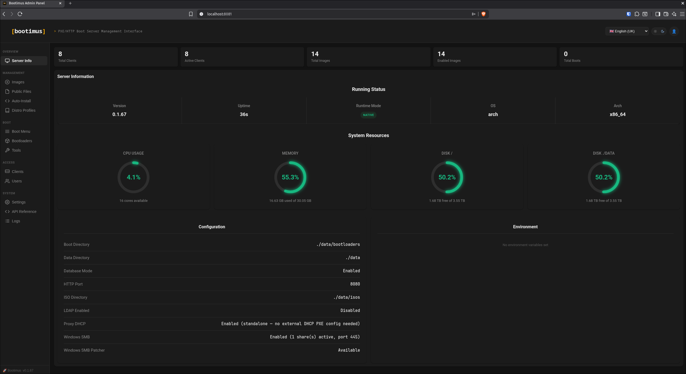
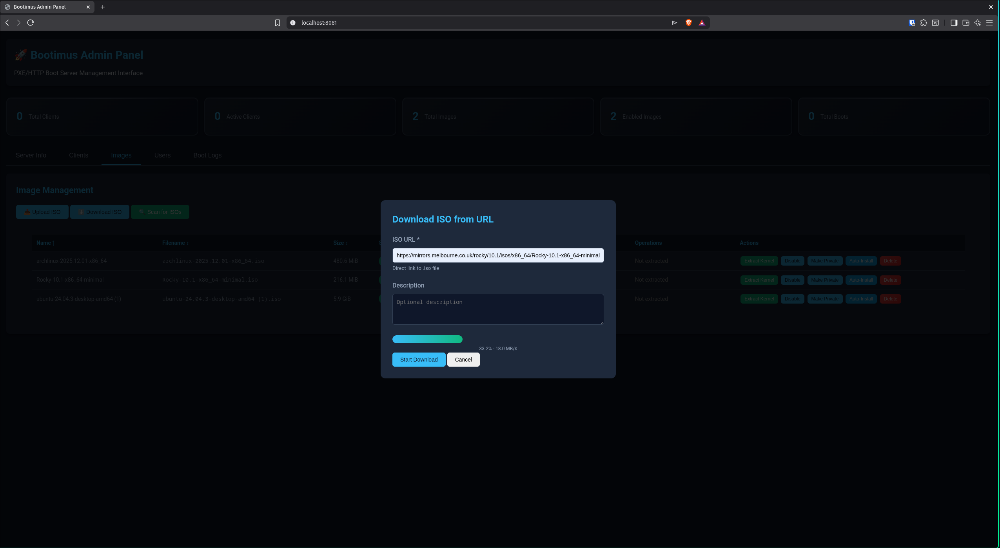

# Bootimus - Modern PXE/HTTP Boot Server

**A production-ready, self-contained PXE and HTTP boot server** written in Go with embedded iPXE bootloaders, SQLite/PostgreSQL support, and a full-featured web admin interface. Deploy in seconds with a single binary or Docker container.

## There Be Dragons!

This is an early-stage work-in-progress project - there may be bugs. Please raise an issue for any unexpected behaviour you encounter.

### AI Disclosure

I've used Claude CLI to help with some parts of this project - mostly making the web UI pretty, as I'm NOT a frontend developer. I also used it to generate the docs, but I review them manually - no automatically-generated AI code goes into the project without review from myself.

## Features

- **Self-contained**: Single binary with embedded bootloaders and web UI
- **Zero configuration**: Sensible defaults, works out of the box
- **Database-backed**: SQLite (default) or PostgreSQL support
- **MAC-based ACL**: Granular per-client ISO permissions
- **Admin interface**: Full-featured web UI with REST API
- **Docker ready**: Multi-arch images (amd64/arm64)
- **Kernel extraction**: Faster boots with reduced bandwidth
- **Netboot support**: Debian/Ubuntu network installer optimisation
- **Boot logging**: Real-time tracking with live streaming
- **HTTP Basic Auth**: Auto-generated password on first run

## Screenshots

| Admin Dashboard | Upload ISOs | Download from URL |
|----------------|-------------|-------------------|
|  |  |  |

## Quick Start

### Docker (Recommended)

```bash
# Create data directory
mkdir -p data

# Run with SQLite (no database container needed)
docker run -d \
  --name bootimus \
  --cap-add NET_BIND_SERVICE \
  -p 69:69/udp \
  -p 8080:8080/tcp \
  -p 8081:8081/tcp \
  -v $(pwd)/data:/data \
  garybowers/bootimus:latest

# Check logs for admin password
docker logs bootimus | grep "Admin password"

# Access admin interface
open http://localhost:8081
```

### Standalone Binary

```bash
# Download binary
wget https://github.com/garybowers/bootimus/releases/latest/download/bootimus-amd64
chmod +x bootimus-amd64

# Run (SQLite mode - no database required)
./bootimus-amd64 serve

# Admin panel: http://localhost:8081
```

### Docker Compose

```bash
git clone https://github.com/garybowers/bootimus
cd bootimus
docker-compose up -d
```

## Documentation

### Quick Links

- **[Deployment Guide](docs/deployment.md)** - Docker, binary, networking, and storage
- **[Image Management](docs/images.md)** - Upload ISOs, extract kernels, netboot support
- **[Admin Console](docs/admin.md)** - Web UI and REST API reference
- **[DHCP Configuration](docs/dhcp.md)** - Configure your DHCP server
- **[Client Management](docs/clients.md)** - MAC-based access control
- **[Security Guide](docs/security.md)** - Best practises and hardening


## Tested Images

### Arch Based
- ✅ archlinux-2025.12.01-x86_64.iso

### RHEL Based
- ✅ Rocky-10.1-x86_64-minimal.iso
- ✅ Fedora-KDE-Desktop-Live-43-1.6.x86_64.iso

### Debian/Ubuntu Based
- ✅ ubuntu-24.04-live-server-amd64.iso (with netboot)
- ✅ ubuntu-24.04-desktop-amd64.iso (with fetch optimisation)
- ✅ debian-13.2.0-amd64-netinst.iso (with netboot)

## Roadmap

- NixOS support (and maybe inject nixconfig to the image?)
- FreeBSD support
- NetBSD support
- OpenBSD support
- Windows support

## Why Bootimus Over iVentoy?

| Feature | Bootimus | iVentoy |
|---------|----------|---------|
| **Language** | Go | C |
| **Single Binary** | ✅ Yes | ❌ No |
| **Embedded Bootloaders** | ✅ Yes | ❌ No |
| **Database** | SQLite / PostgreSQL | File-based |
| **Web UI** | ✅ Modern REST API | Basic HTML |
| **Authentication** | HTTP Basic Auth | None |
| **Boot Logging** | ✅ Full tracking | Limited |
| **MAC-based ACL** | ✅ Granular | ❌ No |
| **ISO Upload** | ✅ Web upload | Manual copy |
| **Docker Support** | ✅ Multi-arch | Limited |
| **API-First** | ✅ RESTful API | ❌ No |
| **Licence** | Apache 2.0 | GPL |


## DHCP Configuration

Configure your DHCP server to point clients to Bootimus. Example for ISC DHCP:

```conf
subnet 192.168.1.0 netmask 255.255.255.0 {
    range 192.168.1.100 192.168.1.200;
    next-server 192.168.1.10;  # Bootimus server IP

    # Chain to HTTP after iPXE loads
    if exists user-class and option user-class = "iPXE" {
        filename "http://192.168.1.10:8080/menu.ipxe";
    }
    # UEFI systems
    elsif option arch = 00:07 or option arch = 00:09 {
        filename "ipxe.efi";
    }
    # Legacy BIOS
    else {
        filename "undionly.kpxe";
    }
}
```

See [DHCP Configuration Guide](docs/dhcp.md) for Dnsmasq, MikroTik, Ubiquiti, and more.

## 🛠️ Building from Source

```bash
# Clone repository
git clone https://github.com/garybowers/bootimus
cd bootimus

# Build
make build

# Or manually
CGO_ENABLED=0 go build -o bootimus .

# Run
./bootimus serve
```

### Multi-Architecture Build

```bash
# AMD64
CGO_ENABLED=0 GOOS=linux GOARCH=amd64 go build -o bootimus-amd64

# ARM64
CGO_ENABLED=0 GOOS=linux GOARCH=arm64 go build -o bootimus-arm64

# ARMv7
CGO_ENABLED=0 GOOS=linux GOARCH=arm GOARM=7 go build -o bootimus-armv7
```

## Security Considerations

- **Read-only TFTP**: TFTP server is read-only (no write operations)
- **Path sanitisation**: All file paths sanitised to prevent directory traversal
- **MAC address verification**: ISOs served only to authorised clients
- **Admin authentication**: HTTP Basic Auth with SHA-256 password hashing
- **Separate admin port**: Admin interface isolated from boot network
- **Audit logs**: All boot attempts logged with client/image/success tracking

See [Security Guide](docs/security.md) for best practises.

## Troubleshooting

### Permission Denied on Port 69

```bash
# Run as root
sudo ./bootimus serve

# Or use Docker with NET_BIND_SERVICE
docker run --cap-add NET_BIND_SERVICE ...

# Or use non-privileged port
./bootimus serve --tftp-port 6969
```

### No ISOs in Menu

```bash
# Check data directory
ls -la data/isos/

# Scan for ISOs via API
curl -u admin:password -X POST http://localhost:8081/api/scan

# Enable public access to images
curl -u admin:password -X PUT http://localhost:8081/api/images?filename=ubuntu.iso \
  -H "Content-Type: application/json" \
  -d '{"public": true, "enabled": true}'
```

### Database Connection Failed

```bash
# Check SQLite database
ls -la data/bootimus.db

# For PostgreSQL, test connection
psql -h localhost -U bootimus -d bootimus
```

See full [Troubleshooting Guide](docs/troubleshooting.md) for more solutions.

## Licence

Licensed under the Apache Licence, Version 2.0. See [LICENSE](LICENSE) for details.

Copyright 2025 Bootimus Contributors

## Contributing

Contributions welcome! Please open an issue or pull request.

## Links

- **GitHub**: https://github.com/garybowers/bootimus
- **Docker Hub**: https://hub.docker.com/r/garybowers/bootimus
- **Documentation**: https://github.com/garybowers/bootimus/tree/main/docs

